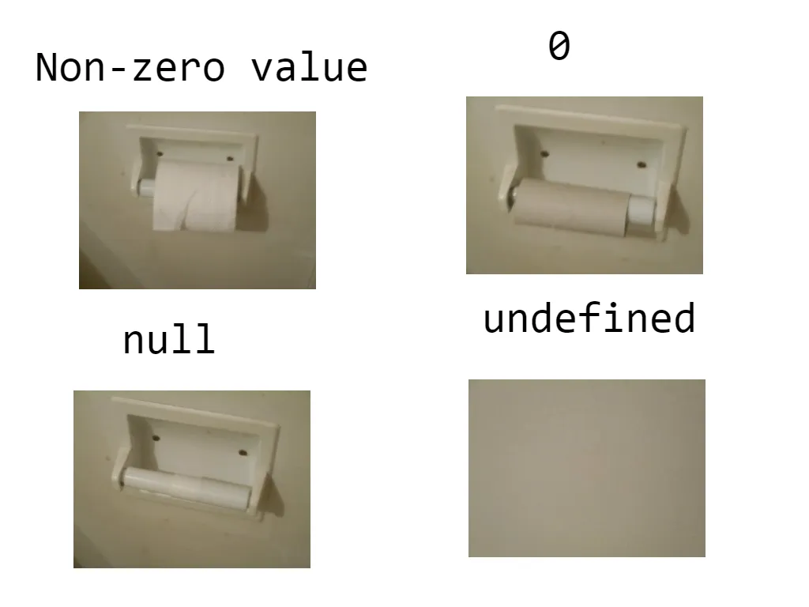

# Data Types // Veri Tipleri

Data type is the process of classifying data to be stored within variables based on the type of data. Data types are a fundamental concept in every programming language. When performing an operation, we specify the type of data that will be stored inside a variable in advance. This way, the computer allocates memory space accordingly and can perform the appropriate operation.

1. Primitive Data Types:

- String
- Number
- Boolean
- Undefined
- Null
- Symbol

2. Non-Primitive (Reference) Data Type:

- Object
- Array
- Function
  > JavaScript is a dynamic language, meaning a variable can hold any data type at any time. For example:

```javascript
var x = 100;
x = "javascript";
x = false;
x = null;
x = undefined;

alert(x); // undefined
```

> The x variable will hold the value of undefined in the end.

> You can use the typeof operator to determine the data type of a variable.
> If you want to check any structural type within an object,
> using typeof is not meaningful because it always returns "object." In such cases,
> using the instanceof operator might be more logical.

```javascript
var myString = new String();
var myDate = new Date();
var myString2 = "string";
console.log(myString instanceof Object); // true
console.log(myString instanceof Date); // false
console.log(myString instanceof String); // true
console.log(myDate instanceof Date); // true
console.log(myDate instanceof Object); // true
console.log(myDate instanceof String); // false
console.log(myString2 instanceof String); // false !!!!!!
```

# Primitive Data Types

All data types in JavaScript that are not objects represent immutable values. For example, unlike in C, strings are immutable in JavaScript. These values are known as primitive values.

Variables declared with primitive values hold their values.
In contrast, reference types hold a reference or address to the value, not the value itself.

## JavaScript String

The string data type stores textual expressions. String data is assigned to variables using double quotes (") or single quotes (').

```javascript
var bandName1 = "Rammstein"; // double quotes
var bandName2 = "Rammstein"; // single quotes
```

When you need to use the same type of quotation marks within a string, make sure to use a different type to avoid errors.

```javascript
// Correct usage, single quotes within double quotes or vice versa
var answer = 'He is called "Johnny"';
```

## JavaScript Number

> In JavaScript, there is only one type of number. If a number has a decimal point,
> use a period (.) instead of a, comma (,).
> Also, when assigning a numerical value, do not enclose it in quotes,
> as it will be interpreted as a string if you do.

```javascript
var age = 25;
console.log(typeof age); // number
var money = 73.25;
console.log(typeof money); // number

var year = "1966";
console.log(typeof year); // string
```

Additionally, there are special values for the number type: "infinity," "-Infinity," and "NaN" (Not a Number).

## JavaScript Boolean

The boolean data type can only have two values: true and false. It is commonly used in conditional statements.

```javascript
var isChecked = true;
console.log(isChecked); // boolean
alert(2 > 1); // true
alert(2 == 1); // false
alert(2 != 1); // true
alert("Z" > "A"); // true
alert("Glow" > "Glee"); // true
```

## JavaScript Undefined

In JavaScript, if a variable is declared but not assigned a value, or if a variable has no value, it is represented as "undefined."

```javascript
var x;
var y = undefined;
var z = "";
console.log(typeof x); // undefined
console.log(typeof y); // undefined
console.log(typeof z); // string
```

As seen above, an empty assignment is not defined as "undefined" but as a string. This is because there is an assignment here, as mentioned earlier, "undefined" is used for values that have not been assigned.

## JavaScript Null

Although null is a primitive value in JavaScript, it is perceived as an object. When you assign a null value to data, memory space is allocated, but it indicates that there is no value.

This special case is still considered a bug in JavaScript. Null is a unique and important value.

When you compare null to undefined, you will find that they have the same value but are of different types.

```javascript
typeof undefined; // undefined
typeof null; // object

null === undefined; // false
null == undefined; // true
```


