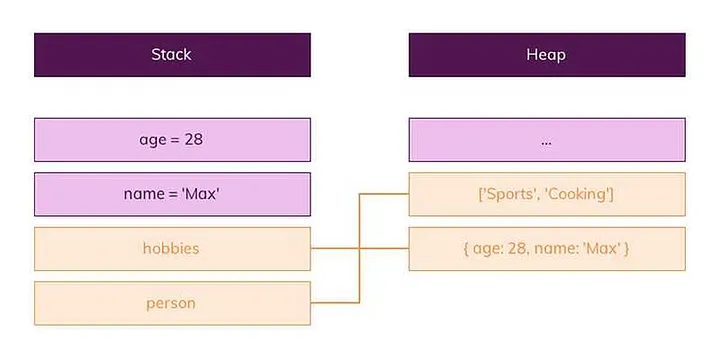
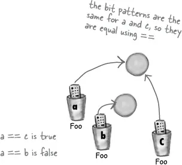

# JavaScript Objects

In general, data of reference type is called Objects. The object type is a special type. All other types are called "primitive" because they can only contain a single value (such as text or a number, etc.). In contrast, objects are used to store data collections and more complex entities.

```javascript
var address = {
  city: "Istanbul",
  country: "Turkey",
  number: 12,
};
```

```javascript
console.log(address); // object
```

As mentioned at the beginning of the text, this is the difference from primitive data. To illustrate a bit more:

JavaScript has to store the values we assign to variables in memory, and there are two types of memory areas, the stack, and the heap.

The stack is actually a simple, easily accessible, and managed area. Only variables with a known size are stored in the stack. These are primitive data types such as numbers, strings, and booleans.



Data types with an unknown size and structure are stored in the heap. Objects and arrays can be mutated at runtime, so they are stored in the heap.

Additionally, if we use (==) with primitive types, it checks whether the values inside the variables are equal.

In reference types, (==) checks whether the addresses of objects are equal. If you want to check whether the values inside variables are equal, in this case, the equals method is used.



# Object:

JavaScript objects are a data structure that contains key-value pairs. The keys of these objects are usually strings or symbols, and their values can be any data type, including other objects. Objects are used to represent complex data structures.

```javascript
var user = {
  name: "Ahmet",
  age: 30,
};
```

# Array:

An array is a special object that stores the same or different data types in an ordered list. Arrays are commonly used to store and manipulate data collections.

```javascript
var fruits = ["apple", "pear", "strawberry"];
```

# Function:

In JavaScript, functions are also objects. Functions package blocks of code into reusable units. They can be assigned to variables, passed as parameters to other functions, and returned from functions.

```javascript
function add(a, b) {
  return a + b;
}
```

# Date:

The Date object represents a specific moment in time, including date and time information. It is used for performing date and time-related operations.

```javascript
var today = new Date();
```

# RegExp (Regular Expression):

The RegExp object is used to search for or manipulate text based on specific patterns. It is commonly used in text processing and search operations.

```javascript
var pattern = /a[b-z]+/i; // Searches for any text that starts with "ab" case-insensitively
```

# Map and Set:

These collection types were introduced with ECMAScript 6 (ES6) and allow you to create more complex data structures. Map stores key-value pairs, and Set stores unique values.

```javascript
var map = new Map();
map.set("key", "value");
var uniqueValues = new Set();
uniqueValues.add(42);
```

Reference data types store how to access real data (addresses) in memory instead of the actual data. When two variables have the same reference, changing one affects the other because both point to the same memory address. Therefore, it's important to understand how data is shared and modified when working with these data types.
