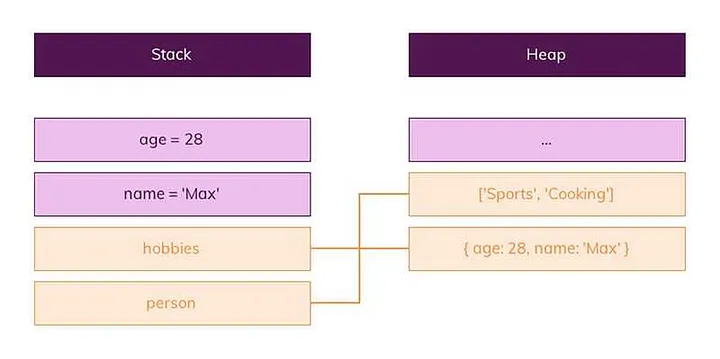
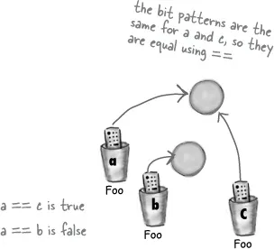

# JavaScript Objects

Genel olarak Reference veri türlerine Objects denir. Nesne türü özel bir tür olarak geçer. Diğer tüm türler “ilkel” olarak adlandırılır çünkü değerleri yalnızca tek bir şey içerebilir (bir metin veya sayı vb.). Aksine, nesneler veri koleksiyonlarını ve daha karmaşık varlıkları depolamak için kullanılır.

```javascript
var address= {
   city: 'İstanbul',
   country: 'Türkiye'
   number : 12
}
```

```javascript
console.log(address); // object
```

İlkel verilerden farkına yazının en başında değinmiştik. Biraz daha örneklemek gerekirse:

Javascript, değişkenlere atadığımız değerleri bellekte saklamak zorundadır ve iki tip bellek alanı vardır. Bunlar stack ve heap alanlarıdır.

Stack aslında kolay erişilebilen basit yönetilen bir alandır. Sadece büyüklüğü belli olan değişkenler stack alanında saklanır. Bunlar numbers, string ve boolean gibi ilkel veri tipleridir.



Boyutu ve yapısı belli olmayan veri tipleri yani heap alanında saklanır. Nesneler (object) ve diziler (array) çalışma zamanında mutasyona uğrayabilirler bu nedenle heap alanında saklanırlar.

Ayrıca; ilkel tiplerde (==) kullanırsak bu değişkenlerin içindeki değerlerin eşit olup olmadığına kontrol eder.

Referans tiplerde ise (==) nesnelerin adreslerinin eşit olup olmadığını kontrol eder. Eğer değişkenlerin içindeki değerlerin eşit olup olmadığını kontrol etmek istiyorsak, bu durumda equals metodu kullanılır.



# Object (Nesne):

JavaScript nesneleri, anahtar-değer çiftlerini içeren bir veri yapısıdır. Bu nesnelerin anahtarları genellikle dizeler veya sembollerdir ve değerleri diğer nesneler dahil herhangi bir veri türü olabilir. Nesneler karmaşık veri yapılarını temsil etmek için kullanılır.

```javascript
var kullanici = {
  ad: "Ahmet",
  yas: 30,
};
```

# Array (Dizi):

Bir dizi, sıralı bir liste içinde aynı veya farklı veri türlerinin saklandığı özel bir nesnedir. Diziler veri koleksiyonlarını saklamak ve işlemek için yaygın olarak kullanılır.

```javascript
var meyveler = ["elma", "armut", "çilek"];
```

# Function (Fonksiyon):

JavaScript'te fonksiyonlar da birer nesnedir. Fonksiyonlar kod bloklarını paketleyip tekrar kullanılabilir hale getirirler. Değişkenlere atanabilir, başka fonksiyonlara parametre olarak iletilip döndürülebilirler.

```javascript
function topla(a, b) {
  return a + b;
}
```

# Date (Tarih):

Tarih nesnesi, belirli bir anın tarih ve saatini temsil eder. Tarih ve saat işlemleri yapmak için kullanılır.

```javascript
var bugun = new Date();
```

# RegExp (Düzenli İfade):

RegExp nesnesi, metin içinde belirli desenleri aramak veya değiştirmek için kullanılır. Genellikle metin işleme ve arama işlemlerinde kullanılır.

```javascript
var desen = /a[b-z]+/i; // Büyük/küçük harf duyarlılığı olmadan "ab" ile başlayan herhangi bir metni arar
```

# Map ve Set:

ECMAScript 6 (ES6) ile tanıtılan bu koleksiyon türleri, daha karmaşık veri yapıları oluşturmanıza olanak tanır. Map anahtar-değer çiftlerini saklarken, Set benzersiz değerleri saklar.

```javascript
var harita = new Map();
harita.set("anahtar", "değer");
var benzersizDegerler = new Set();
benzersizDegerler.add(42);
```

Referans veri türleri bellekte gerçek verilerin yerine bu verilere nasıl ulaşılacağını (adresleri) saklarlar. İki değişken aynı referansa sahip olduğunda, birini değiştirmek diğerini de etkiler, çünkü her ikisi de aynı bellek adresini işaret eder. Bu nedenle, bu veri türleriyle çalışırken, verilerin nasıl paylaşıldığını ve değiştirildiğini anlamak önemlidir.
