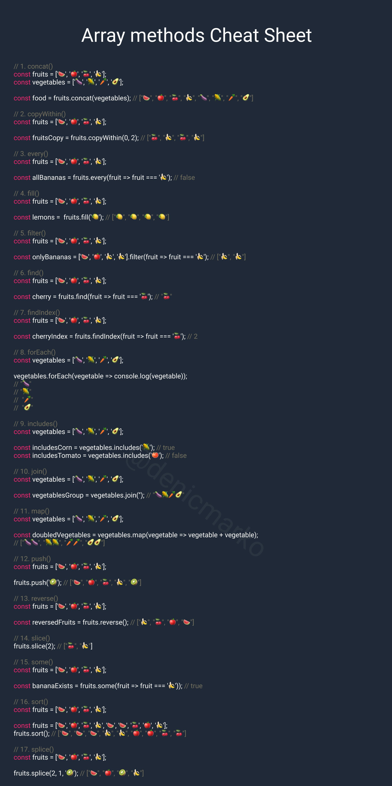

# JavaScript

provides powerful and commonly used data structures for working with arrays. Arrays are used to store multiple items in a single variable. Here are some important topics related to JavaScript arrays:

## Array Creation:

Arrays can be created in several ways. Here are some examples:

```javascript
// Creating an empty array
const emptyArray = [];

// Creating an array with elements
const fruits = ["apple", "banana", "strawberry"];

// Creating an array using the Array() constructor
const colors = new Array("red", "green", "blue");
```

## Accessing Array Elements:

You can access array elements using their indices, which start from 0.

```javascript
const fruits = ["apple", "banana", "strawberry"];
console.log(fruits[0]); // 'apple'
console.log(fruits[1]); // 'banana'
```

## Array Length:

To find the length of an array, you can use the length property.

```javascript
const fruits = ["apple", "banana", "strawberry"];
console.log(fruits.length); // 3
```

## Array Methods:

JavaScript provides built-in methods to work with arrays. For example, methods like push, pop, shift, unshift, splice, concat, map, filter, reduce, and more make array manipulation easier.

```javascript
const numbers = [1, 2, 3, 4, 5];
numbers.push(6); // Adds 6 to the array
const lastNumber = numbers.pop(); // Removes the last element from the array
```

## Array Loops:

You can iterate over arrays using loops such as for, and you can also use methods like forEach, map, filter, reduce, and for...of for iteration.

```javascript
const fruits = ["apple", "banana", "strawberry"];

// Iterating with forEach
fruits.forEach(function (fruit) {
  console.log(fruit);
});

// Iterating with for...of
for (const fruit of fruits) {
  console.log(fruit);
}
```

## Array Operations:

Common array operations include adding elements, removing elements, sorting, searching, filtering, and transforming.

```javascript
const fruits = ['elma', 'muz', 'çilek'];
fruits.push('portakal');
// fruits şimdi ['elma', 'muz', 'çilek', 'portakal']
pop(): Dizinin sonundan bir öğe çıkarır.
const fruits = ['elma', 'muz', 'çilek'];
fruits.pop();
// fruits şimdi ['elma', 'muz']
unshift(): Diziye bir veya daha fazla öğe ekler, ancak bu kez dizinin başına ekler.
const fruits = ['elma', 'muz', 'çilek'];
fruits.unshift('portakal');
// fruits şimdi ['portakal', 'elma', 'muz', 'çilek']
shift(): Dizinin başından bir öğe çıkarır.
const fruits = ['elma', 'muz', 'çilek'];
fruits.shift();
// fruits şimdi ['muz', 'çilek']
concat(): İki veya daha fazla diziyi birleştirir.
const fruits = ['elma', 'muz'];
const moreFruits = ['çilek', 'portakal'];
const combined = fruits.concat(moreFruits);
// combined şimdi ['elma', 'muz', 'çilek', 'portakal']
slice(): Dizi içerisinden belirli bir aralığı (başlangıç ve bitiş indeksleri) kopyalar.
const fruits = ['elma', 'muz', 'çilek', 'portakal'];
const sliced = fruits.slice(1, 3);
// sliced şimdi ['muz', 'çilek']
splice(): Dizi içerisinden belirli bir aralığı (başlangıç ve silinecek öğelerin sayısı) değiştirir veya kaldırır.
const fruits = ['elma', 'muz', 'çilek', 'portakal'];
fruits.splice(1, 2); // 1. indeksten itibaren 2 öğeyi kaldır
// fruits şimdi ['elma', 'portakal']
forEach(): Dizi içerisindeki her öğe için bir işlevi çağırır.
const numbers = [1, 2, 3, 4, 5];
numbers.forEach(function(number) {
console.log(number);
});
```

JavaScript arrays are versatile and powerful, and they can be used in a wide range of scenarios. They are frequently used for data storage, processing, and obtaining results.



### Array Creation and Copying Methods:

Array() or []: Creates a new array.
Array.from(): Converts an array-like object or iterable into an array.
Array.of(): Creates a new array with specified elements.
concat(): Combines two or more arrays and returns a new array.
copyWithin(): Copies a portion of the array to a specified position.
slice(): Copies a portion of the array and returns a new array.

### Array Modification Methods:

push(): Adds one or more elements to the end of the array.
pop(): Removes an element from the end of the array.
unshift(): Adds one or more elements to the beginning of the array.
shift(): Removes an element from the beginning of the array.
splice(): Modifies or removes a portion of the array.

### Array Filtering and Transformation Methods:

filter(): Returns a new array with elements that meet a specified condition.
map(): Applies a function to each element and returns a new array.
reduce(): Combines array elements into a single value.
reduceRight(): Combines array elements from right to left into a single value.
reverse(): Reverses the order of elements in the array.
sort(): Sorts the array.

### Array Searching and Modification Methods:

indexOf(): Returns the index of a specified element.
lastIndexOf(): Returns the last index of a specified element.
find(): Returns the first element that meets a specified condition.
findIndex(): Returns the index of the first element that meets a specified condition.
includes(): Returns true if a specific element is found in the array.
some(): Returns true if at least one element meets a specified condition.
every(): Returns true if all elements meet a specified condition.
fill(): Fills the array with a specified value.
join(): Joins array elements into a string.
toString(): Joins array elements into a string.

### Array Size and Information Methods:

length: Returns the length of the array.
isArray(): Checks if an object is an array.
concat(): Combines two or more arrays and returns a new array.

### Array Modification Methods:

copyWithin(): Copies a portion of the array to a specified position.
fill(): Fills the array with a specified value.
sort(): Sorts the array elements alphabetically or numerically.
