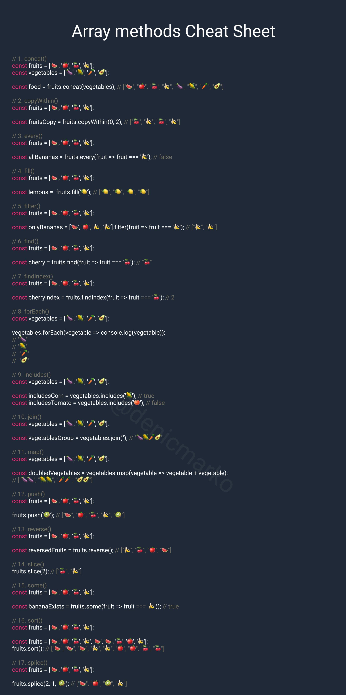

# JavaScript, dizileri (arrays)

işlemek için çok güçlü ve yaygın olarak kullanılan bir veri yapısıdır. Diziler, birden çok öğeyi tek bir değişken içinde saklamak için kullanılırlar. İşte JavaScript dizileri ile ilgili bazı önemli konular:

## Dizi Oluşturma:

Diziler, birçok farklı yolla oluşturulabilir. İşte bazı örnekler:

```javascript
// Boş bir dizi oluşturma
const emptyArray = [];

// İçerisine öğeler eklenmiş bir dizi
const fruits = ["elma", "muz", "çilek"];

// Array() constructor kullanarak dizi oluşturma
const colors = new Array("kırmızı", "yeşil", "mavi");
```

## Dizi Elemanlarına Erişim:

Dizi elemanlarına erişmek için indeksleri kullanabilirsiniz. İndeksler sıfırdan başlar.

```javascript
const fruits = ["elma", "muz", "çilek"];
console.log(fruits[0]); // 'elma'
console.log(fruits[1]); // 'muz'
```

## Dizi Uzunluğu:

Dizi uzunluğunu öğrenmek için length özelliğini kullanabilirsiniz.

```javascript
const fruits = ["elma", "muz", "çilek"];
console.log(fruits.length); // 3
```

## Dizi Metotları:

JavaScript dizileri ile çalışırken birçok yerleşik metot kullanabilirsiniz. Örneğin, push, pop, shift, unshift, splice, concat, map, filter, reduce vb. gibi metotlar dizilerle çalışmayı kolaylaştırır.

```javascript
const numbers = [1, 2, 3, 4, 5];
numbers.push(6); // Diziye 6 ekler
const lastNumber = numbers.pop(); // Dizinin son öğesini çıkarır
```

## Dizi Döngüleri:

Diziler üzerinde döngüler kullanarak her bir elemanı işleyebilirsiniz. for döngüsü, forEach, map, filter, reduce, ve for...of gibi farklı yöntemler kullanılabilir.

```javascript
const fruits = ["elma", "muz", "çilek"];

// forEach ile dizi elemanlarına erişme
fruits.forEach(function (fruit) {
  console.log(fruit);
});

// for...of ile dizi elemanlarına erişme
for (const fruit of fruits) {
  console.log(fruit);
}
```

## Dizi İşlemleri:

Dizilerle sıkça yapılan işlemler arasında eleman eklemek, çıkarmak, sıralamak, aramak, filtrelemek ve dönüştürmek gibi işlemler bulunur.

```javascript
const numbers = [3, 1, 2, 4, 5];
numbers.sort(); // Diziyi sıralar: [1, 2, 3, 4, 5]
const filtered = numbers.filter((number) => number > 2); // 2'den büyük olanları filtreler
```

JavaScript dizileri oldukça esnek ve güçlüdür ve birçok farklı senaryoda kullanılabilirler. Veri saklamak, işlem yapmak ve sonuçları elde etmek için sıkça kullanılan bir veri yapısıdır.

JavaScript'da dizi (array) nesneleri ile çalışırken kullanabileceğiniz çeşitli yöntemler (metotlar) vardır. İşte bazı yaygın dizi metotları:

push(): Diziye bir veya daha fazla öğe ekler.

```javascript
const fruits = ['elma', 'muz', 'çilek'];
fruits.push('portakal');
// fruits şimdi ['elma', 'muz', 'çilek', 'portakal']
pop(): Dizinin sonundan bir öğe çıkarır.
const fruits = ['elma', 'muz', 'çilek'];
fruits.pop();
// fruits şimdi ['elma', 'muz']
unshift(): Diziye bir veya daha fazla öğe ekler, ancak bu kez dizinin başına ekler.
const fruits = ['elma', 'muz', 'çilek'];
fruits.unshift('portakal');
// fruits şimdi ['portakal', 'elma', 'muz', 'çilek']
shift(): Dizinin başından bir öğe çıkarır.
const fruits = ['elma', 'muz', 'çilek'];
fruits.shift();
// fruits şimdi ['muz', 'çilek']
concat(): İki veya daha fazla diziyi birleştirir.
const fruits = ['elma', 'muz'];
const moreFruits = ['çilek', 'portakal'];
const combined = fruits.concat(moreFruits);
// combined şimdi ['elma', 'muz', 'çilek', 'portakal']
slice(): Dizi içerisinden belirli bir aralığı (başlangıç ve bitiş indeksleri) kopyalar.
const fruits = ['elma', 'muz', 'çilek', 'portakal'];
const sliced = fruits.slice(1, 3);
// sliced şimdi ['muz', 'çilek']
splice(): Dizi içerisinden belirli bir aralığı (başlangıç ve silinecek öğelerin sayısı) değiştirir veya kaldırır.
const fruits = ['elma', 'muz', 'çilek', 'portakal'];
fruits.splice(1, 2); // 1. indeksten itibaren 2 öğeyi kaldır
// fruits şimdi ['elma', 'portakal']
forEach(): Dizi içerisindeki her öğe için bir işlevi çağırır.
const numbers = [1, 2, 3, 4, 5];
numbers.forEach(function(number) {
console.log(number);
});
// 1, 2, 3, 4, 5 yazdırır
```

Bu sadece birkaçıdır; JavaScript'te dizilerle çalışmak için kullanabileceğiniz birçok başka metot bulunmaktadır. Dizilerle çalışırken ihtiyaçlarınıza göre uygun metotları seçebilirsiniz.



---

### Dizi Oluşturma ve Kopyalama Metotları:

`Array()` veya []: Yeni bir dizi oluşturur.
<br/>

`Array.from()`: Bir dizi benzeri nesneyi veya iterable'ı bir diziye dönüştürür.
<br/>

`Array.of()`: Belirtilen öğeleri içeren yeni bir dizi oluşturur.
<br/>

`concat()`: İki veya daha fazla diziyi birleştirir ve yeni bir dizi döndürür.
<br/>

`copyWithin()`: Dizinin belirli bir kısmını belirtilen pozisyona kopyalar.
<br/>

`slice()`: Dizi içerisinden belirli bir aralığı kopyalar ve yeni bir dizi döndürür.

### Dizi Değiştirme Metotları:

`push()`: Diziye bir veya daha fazla öğe ekler.
<br/>

`pop()`: Dizinin sonundan bir öğe çıkarır.
<br/>

`unshift()`: Diziye bir veya daha fazla öğe ekler ve dizinin başına yerleştirir.
<br/>

`shift()`: Dizinin başından bir öğe çıkarır.
<br/>

`splice()`: Dizi içerisinden belirli bir aralığı değiştirir veya kaldırır.

### Dizi Filtreleme ve Dönüştürme Metotları:

`filter()`: Belirli bir koşulu karşılayan öğeleri içeren yeni bir dizi döndürür.
<br/>

`map()`: Dizideki her öğeyi belirli bir işlemden geçirip yeni bir dizi döndürür.
<br/>

`reduce()`: Dizi öğelerini birleştirerek tek bir değer döndürür.
<br/>

`reduceRight()`: Dizi öğelerini sağdan sola doğru birleştirerek tek bir değer döndürür.
<br/>

`reverse()`: Dizinin sırasını tersine çevirir.<br/>
`sort()`: Diziyi sıralar.<br/>

### Dizi Arama ve Düzenleme Metotları:

`indexOf()`: Belirli bir öğenin indeksini döndürür.<br/>
`lastIndexOf()`: Belirli bir öğenin sondan itibaren indeksini döndürür.<br/>
`find()`: Belirli bir koşulu sağlayan ilk öğeyi döndürür.<br/>
`findIndex()`: Belirli bir koşulu sağlayan ilk öğenin indeksini döndürür.<br/>
`includes()`: Belirli bir öğe dizide bulunuyorsa true döndürür.<br/>
`some()`: Belirli bir koşulu sağlayan en az bir öğe varsa true döndürür.<br/>
`every()`: Tüm öğelerin belirli bir koşulu sağlaması durumunda true döndürür.<br/>
`fill()`: Diziyi belirtilen bir değerle doldurur.<br/>
`join()`: Dizi öğelerini birleştirip bir karakter dizisi döndürür.<br/>
`toString()`: Dizi öğelerini birleştirip bir karakter dizisi olarak döndürür.<br/>

### Dizi Boyut ve Bilgi Metotları:

`length`: Dizi uzunluğunu döndürür.<br/>
`isArray()`: Bir nesnenin bir dizi olup olmadığını kontrol eder.<br/>
`concat()`: İki veya daha fazla diziyi birleştirir ve yeni bir dizi döndürür.<br/>

### Dizi Düzenleme Metotları:

`copyWithin()`: Dizi içerisinden belirli bir kısmını belirtilen pozisyona kopyalar.<br/>
`fill()`: Diziyi belirtilen bir değerle doldurur.<br/>
`sort()`: Dizi öğelerini alfabetik veya sayısal olarak sıralar.<br/>
