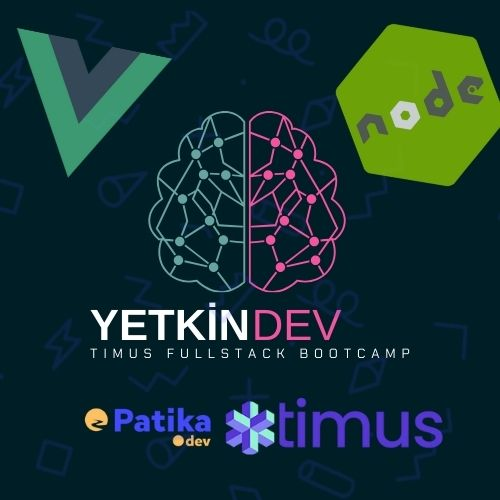

# Welcome to Timus Fullstack bootcamp

## Timus Network ve Patika.dev tarafıdan gerçekleştirilen bir Eğitim reposudur.

|             Hafta             |                                                                                                            Konular                                                                                                            |
| :---------------------------: | :---------------------------------------------------------------------------------------------------------------------------------------------------------------------------------------------------------------------------: |
| [1.Hafta](tree/master/Hafta1) |                    [Js History - Primitive Data Types - Referance Data Types - Arrays Metots - Bonus Rest parameters, Spread -Using Rest Parameter Instead of ReduceOperator - FizzBuzz Homework ](Hafta1)                    |
| [2.Hafta](tree/master/Hafta2) | [ Switch-Case - Object and Class - Object Methods - Deep on the Class - Get And Set Vs Private-Property - philosophy of synchronous and asynchronous programming - Promise Logic - Access Modifier - Promise Chains ](Hafta2) |

| [3.Hafta](tree/master/Hafta3) | [ Creating A Project -i express -i nodemon - diff devDependencies vs Dependencies - HTTP Methods - HTTP Status -Route and Query Parameters - Get Methods - Post Methods - Put Methods - Delete Methods - Dictionary only Turkish ](Hafta3) |
